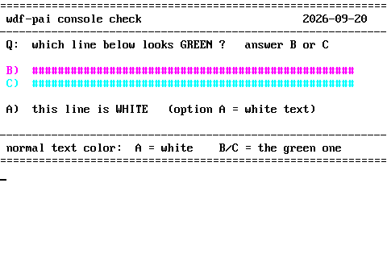
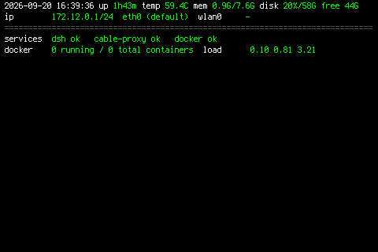

# pi-config

Raspberry Pi 4B (8 GB, Debian 13 trixie) 完整配置备份 + 一键恢复。
Waveshare 3.5" SPI LCD (ILI9486, waveshare35b-v2) + 控制台仪表盘。

测试环境：kernel `6.18.50+rpt-rpi-v8`，2026-09-20。

## 面板效果

**仪表盘 v5**（6×14 字体，80×22 网格，黑底白标签绿数值）：


**配色校准**（证明面板映射 = 纯反相，无通道错位）：



**--loop 实时刷新**（左 16:39:36 → 右 16:39:40，时钟每秒 tick）：




---

## 一键恢复

```bash
git clone https://github.com/shishenshashen/pi-config.git
cd pi-config
sudo bash restore-all.sh
```

这条命令会：
1. 恢复 `boot/config.txt` + `cmdline.txt`（SPI overlay + 反色调色板 + fbcon 字体）
2. 安装 `waveshare35b-v2.dtbo` 到 `/boot/firmware/overlays/`
3. 安装自定义 6x14 字体 + `pi-panel-info` 仪表盘 + systemd 服务
4. 恢复 `/etc/default/console-setup`

自动检测 PARTUUID 差异并修补（换卡时不用手动改 cmdline.txt）。

如果只恢复仪表盘（boot 配置已手动改好）：
```bash
sudo bash restore-all.sh --skip-boot
```

恢复完需要重启（或手动 `sudo dtoverlay waveshare35b-v2 rotate=270` 热加载）。

---

## 仓库结构

```
restore-all.sh          一键恢复脚本（入口）

boot/
  running/
    config.txt          正在用的内核配置（SPI + overlay）
    cmdline.txt         正在用的启动参数（调色板 + fbcon）
  config.txt            出厂原始备份
  cmdline.txt           出厂原始备份

overlays/
  waveshare35b-v2.dtbo  编译好的 SPI 屏 overlay（直接可用）

panel/                  控制台仪表盘
  pi-panel-info             仪表盘渲染器（Python 3）
  pi-panel-info.service     systemd 单元
  pi-panel-info-install.sh  仪表盘安装脚本
  mkfont614.py              字体构建器（6x12 → 6x14）
  wdf-panel-6x14.psf.gz    自定义 6x14 控制台字体

etc/
  console-setup         正在用的 /etc/default/console-setup

dotfiles/               SSH 会话镜像到屏（可选）
  bash_profile
  bashrc

tools/                  诊断工具
  fbcheck.py                帧缓冲读取 → 直方图 + PNG
  sgrprobe*.py              Linux 控制台 SGR 高亮位探针
  console-palette.py        OSC 调色板写入器
  console-demo.py           色彩演示页

screenshots/            面板实拍
  fb-v5-panel.png           v5 最终仪表盘
  fb-v4a-panel.png          --loop 时钟刷新对比 A
  fb-v4b-panel.png          --loop 时钟刷新对比 B
  INIT-07-color-calibration.png  配色校准证明
  INIT-07-panel-info-dashboard.png  仪表盘截图
```

---

## 硬件：Waveshare 3.5" SPI LCD

- ILI9486 控制器，SPI0，480×320 像素
- RST = GPIO 25, DC = GPIO 24, CS1 上是 ADS7846 触摸
- **面板色彩映射（实测）**：显示色 = 255 − framebuffer 值（纯反相，无通道错位）
  - fb `000000` → 白屏；fb `ffffff` → 黑屏

### overlay 来源

官方固件不含 `waveshare35b-v2.dtbo`。仓库里已放编译好的（`overlays/`），
如需重编：

```bash
git clone https://github.com/swkim01/waveshare-dtoverlays.git
dtc -@ -I dts -O dtb -o waveshare35b-v2.dtbo waveshare35b-v2.dts
```

### 运行时热加载（不重启）

```bash
sudo dtoverlay waveshare35b-v2 rotate=270
# 验证：
cat /sys/kernel/config/device-tree/overlays/0_waveshare35b-v2/status  # 应显示 applied
```

---

## 控制台仪表盘

两行状态屏，常驻 `/dev/tty1`：

```
2026-09-20 16:43:04  up 1h46m  temp 58.9C  mem 0.9G/7.6G
ip 172.12.0.1/24 eth0 (default)  wlan0 -  disk 20%/58G free 44G
======================================================================
services  dsh ok   cable-proxy ok   docker ok
docker    0 running / 0 total containers  load      0.38 0.62 2.64
```

- **刷新**：1 秒时钟 + 10 秒慢指标（`--interval N` 可调），无闪烁逐行重绘
- **字体**：自定义 6×14（Terminus 6×12 上下各垫 1px → 80×22 网格）
- **配色**：白标签、亮绿正文、灰分隔线、红告警
- **监控服务**：dsh、dsh-cable-proxy.socket、docker（改 `SERVICES` 元组）

单独装仪表盘（不动 boot）：
```bash
cd panel && sudo bash pi-panel-info-install.sh
```

---

## Linux 控制台踩坑

### SGR 高亮位 bug

Linux 控制台把 90–97（亮色）存为独立的高亮位，和 30–37（基色）分开。
`\033[97m` 后紧跟 `\033[37m` 只改基色不清高亮，正文仍显示白色。

**修复**：设色前先复位
```python
BODY = "\033[0;37m"   # 先 \033[0m 全复位，再设色
```

### 帧缓冲反相

面板显示 `255 − fb`，所以读 `/dev/fb0` 的截图工具必须反色才能还原肉眼所见。
`tools/fbcheck.py` 输出两个文件：`-raw.png`（fb 原样）和 `-panel.png`（反相后）。

### fb_ili9486 无 blank

`/sys/class/graphics/fb0/blank` 读 4、写 0 报 I/O error 是正常的——
上游 `fb_ili9486` 没实现 `.blank` 方法，面板从未被下 display-off。

### SPI DMA

`/proc/interrupts` 里 SPI 计数为 0 不代表没传数据（spi-bcm2835 走 DMA），
要看 `/sys/bus/spi/devices/spi0.0/statistics/bytes`（一帧 ≈ 307 KB）。

---

## 回滚

所有改动可逆，不需要格式化 SD 卡：

| 改了什么 | 怎么退 |
|---|---|
| overlay 已加载 | `sudo dtoverlay -r waveshare35b-v2` |
| config.txt | `sudo cp boot/config.txt /boot/firmware/config.txt`（出厂原版） |
| cmdline.txt | `sudo cp boot/cmdline.txt /boot/firmware/cmdline.txt`（出厂原版） |
| 字体 | `sudo cp etc/console-setup /etc/default/console-setup && sudo setupcon` |
| 仪表盘服务 | `sudo systemctl disable --now pi-panel-info.service` |
| dtbo 文件 | `sudo rm /boot/firmware/overlays/waveshare35b-v2.dtbo` |

`restore-all.sh` 每次运行前自动备份当前文件为 `.bak-<时间戳>`。

---

## 无关的显示输出

- `card1-HDMI-A-1` / `card1-HDMI-A-2` 显示 disconnected 是正常的——那是 HDMI 口，
  跟 SPI 屏无关
- 无 DSI 显示
