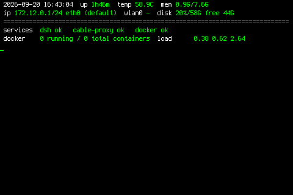

# Raspberry Pi SPI Panel Setup

一键恢复树莓派 3.5" SPI LCD 面板 + 控制台仪表盘配置。


## 面板效果

**仪表盘 v5**（6×14 字体，80×22 网格，黑底白标签绿数值）：


**仪表盘截图**（另一版本）：



**配色校准**（证明面板映射 = 纯反相，无通道错位）：


**--loop 实时刷新**（时钟每秒 tick，10 秒刷新慢指标）：


---

## 快速开始

```bash
git clone https://github.com/shishenshashen/raspberry-pi-panel-setup.git
cd raspberry-pi-panel-setup
sudo bash restore-all.sh
```

**这条命令会：**
1. 恢复 `boot/config.txt` + `cmdline.txt`（SPI overlay + 反色调色板 + fbcon 字体）
2. 安装 `waveshare35b-v2.dtbo` 到 `/boot/firmware/overlays/`
3. 安装自定义 6x14 字体 + `pi-panel-info` 仪表盘 + systemd 服务
4. 恢复 `/etc/default/console-setup`

**特性：**
- ✅ 自动检测 PARTUUID 差异并修补（换 SD 卡不用手动改 cmdline.txt）
- ✅ 恢复前自动备份现有文件为 `.bak-<时间戳>`
- ✅ 支持 `--skip-boot` 只恢复仪表盘（不动 boot 配置）

**恢复后：**
- 重启生效，或手动热加载：`sudo dtoverlay waveshare35b-v2 rotate=270`
- 仪表盘服务自动启动：`systemctl status pi-panel-info`

---

## 包含内容

### 硬件配置
- **SPI 屏 overlay**：`waveshare35b-v2.dtbo`（ILI9486 控制器，480×320，rotate=270）
- **启动配置**：`config.txt` + `cmdline.txt`（含反色调色板补偿）
- **控制台字体**：自定义 6×14（Terminus 6×12 上下各垫 1px → 80×22 网格）

### 软件
- **pi-panel-info**：Python 3 仪表盘渲染器（两行状态屏，常驻 `/dev/tty1`）
  - 显示：时间、uptime、温度、内存、磁盘、IP、服务状态、docker、load
  - 刷新：1 秒时钟 + 10 秒慢指标（`--interval N` 可调）
  - 配色：白标签、亮绿正文、灰分隔线、红告警
  - 监控服务：dsh、dsh-cable-proxy.socket、docker（可改 `SERVICES` 元组）
- **systemd 服务**：`pi-panel-info.service`（开机自启，失败自动重启）

### 工具
- `fbcheck.py`：帧缓冲读取 → 直方图 + PNG（输出 raw 和 inverted 两版）
- `sgrprobe*.py`：Linux 控制台 SGR 高亮位探针
- `console-palette.py`：OSC 调色板写入器
- `console-demo.py`：色彩演示页

---

## 硬件要求

- **树莓派**：Pi 4B（8 GB 测试通过，其他型号未验证）
- **屏幕**：Waveshare 3.5" SPI LCD（ILI9486 控制器，waveshare35b-v2 兼容）
  - RST = GPIO 25, DC = GPIO 24, CS1 上是 ADS7846 触摸
- **系统**：Debian 13 trixie（kernel 6.18+），其他版本未测试

### 面板色彩映射（实测）

**显示色 = 255 − framebuffer 值**（纯反相，无通道错位）

- fb `000000` → 显示白色
- fb `ffffff` → 显示黑色
- fb `ff00ff` → 显示亮绿 `00ff00`

⚠️ 因为面板反相，直接写 `/dev/fb0` 的图要先反色才会显示正常。

---

## 手动安装（分步）

如果不想用一键脚本，可以分步装：

### 1. 安装仪表盘 + 字体（不动 boot）
```bash
cd panel
sudo bash pi-panel-info-install.sh
```

### 2. 安装 overlay（热加载，不重启）
```bash
sudo cp overlays/waveshare35b-v2.dtbo /boot/firmware/overlays/
sudo dtoverlay waveshare35b-v2 rotate=270
```

### 3. 恢复 boot 配置（需重启）
```bash
sudo cp boot/running/config.txt /boot/firmware/config.txt
sudo cp boot/running/cmdline.txt /boot/firmware/cmdline.txt
sudo reboot
```

---

## Linux 控制台踩坑

### SGR 高亮位 bug

Linux 控制台把 90–97（亮色）存为独立的高亮位，和 30–37（基色）分开。
`\033[97m` 后紧跟 `\033[37m` 只改基色不清高亮，正文仍显示白色。

**修复**：设色前先复位
```python
BODY = "\033[0;37m"   # 先 \033[0m 全复位，再设色
```

### fb_ili9486 无 blank

`/sys/class/graphics/fb0/blank` 读 4、写 0 报 I/O error 是正常的——
上游 `fb_ili9486` 没实现 `.blank` 方法，面板从未被下 display-off。

### SPI DMA

`/proc/interrupts` 里 SPI 计数为 0 不代表没传数据（spi-bcm2835 走 DMA），
要看 `/sys/bus/spi/devices/spi0.0/statistics/bytes`（一帧 ≈ 307 KB）。

---

## 回滚

所有改动可逆，不需要格式化 SD 卡：

| 改了什么 | 怎么退 |
|---|---|
| overlay 已加载 | `sudo dtoverlay -r waveshare35b-v2` |
| config.txt | `sudo cp boot/config.txt /boot/firmware/config.txt`（出厂原版） |
| cmdline.txt | `sudo cp boot/cmdline.txt /boot/firmware/cmdline.txt`（出厂原版） |
| 字体 | `sudo cp etc/console-setup /etc/default/console-setup && sudo setupcon` |
| 仪表盘服务 | `sudo systemctl disable --now pi-panel-info.service` |
| dtbo 文件 | `sudo rm /boot/firmware/overlays/waveshare35b-v2.dtbo` |

`restore-all.sh` 每次运行前自动备份当前文件为 `.bak-<时间戳>`。

---

## 无关的显示输出

- `card1-HDMI-A-1` / `card1-HDMI-A-2` 显示 disconnected 是正常的——那是 HDMI 口，跟 SPI 屏无关
- 无 DSI 显示

---

## 测试环境

- Raspberry Pi 4B (8 GB, Debian 13 trixie)
- Kernel: `6.18.50+rpt-rpi-v8`
- Waveshare 3.5" SPI LCD (ILI9486, waveshare35b-v2)
- 2026-09-20

---

## License

MIT License - 详见 [LICENSE](LICENSE) 文件。

## 相关

- overlay 来源：[swkim01/waveshare-dtoverlays](https://github.com/swkim01/waveshare-dtoverlays)
- 如需重编 dtbo：
  ```bash
  git clone https://github.com/swkim01/waveshare-dtoverlays.git
  dtc -@ -I dts -O dtb -o waveshare35b-v2.dtbo waveshare35b-v2.dts
  ```
